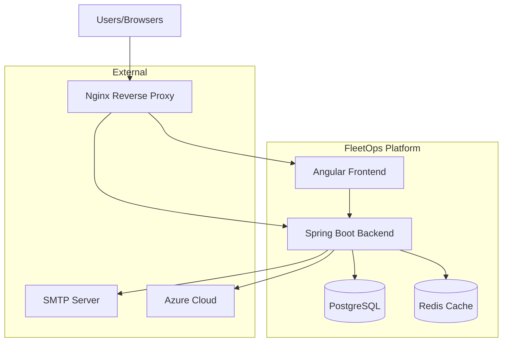
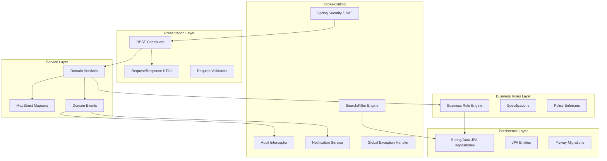
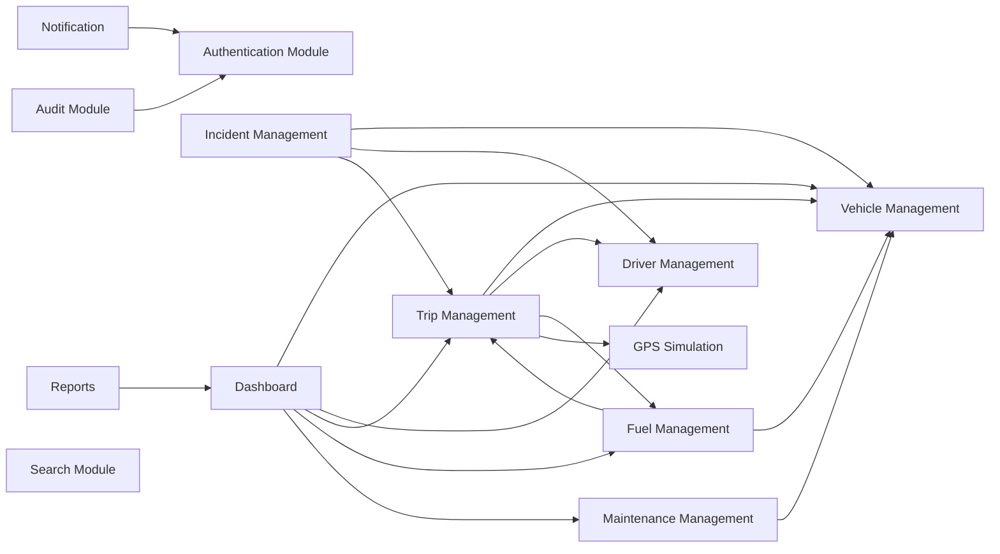
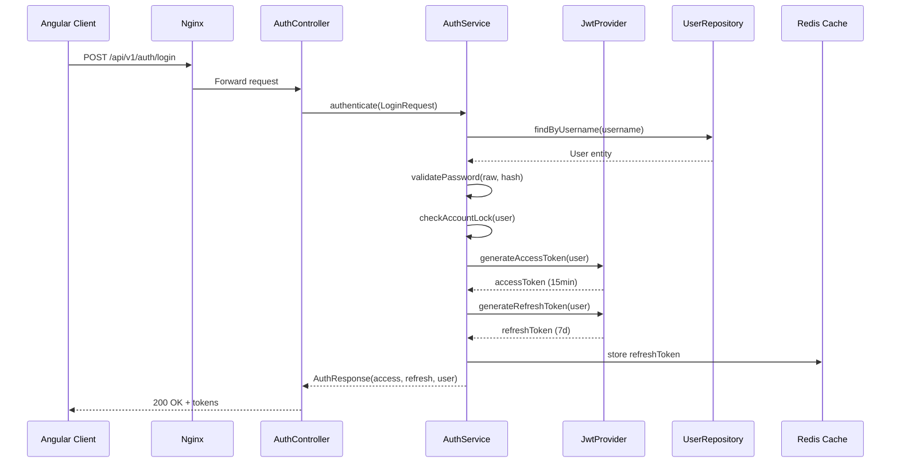
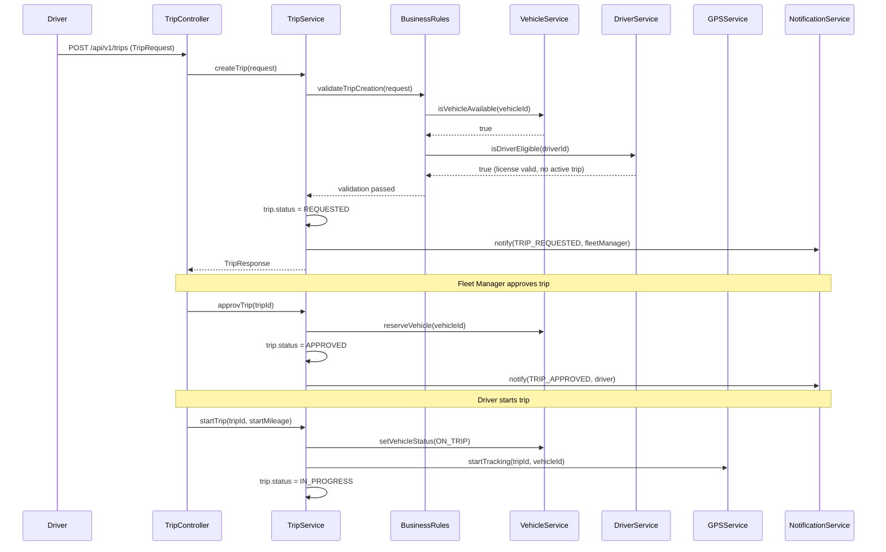
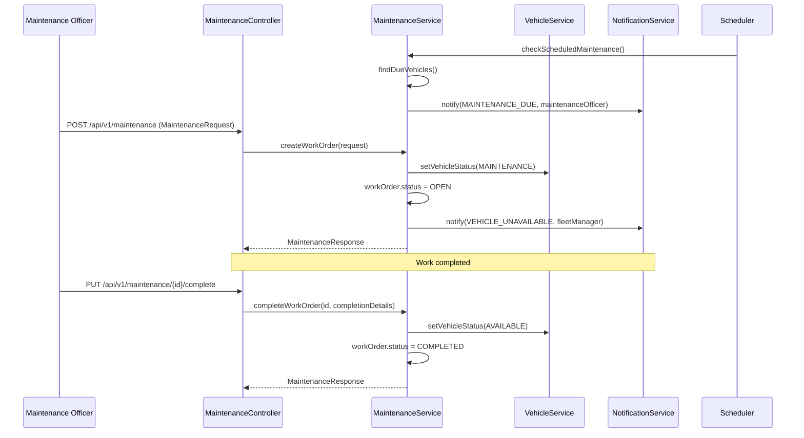
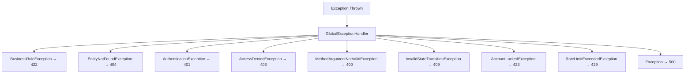

# Design Document: FleetOps Enterprise Fleet Management System

## Overview

FleetOps is an enterprise-grade fleet management platform built on Java 21/Spring Boot 3 (backend) and Angular (frontend) that provides comprehensive vehicle lifecycle management, driver operations, trip planning, fuel analytics, maintenance scheduling, incident tracking, and real-time GPS simulation. The system enforces strict business rules through a clean layered architecture with role-based access control (RBAC) across five user roles: System Administrator, Fleet Manager, Driver, Maintenance Officer, and Executive.

The platform follows a modular monolith design with clear bounded contexts per domain module, communicating through well-defined service interfaces. Each module maintains its own entities, repositories, services, and controllers while sharing cross-cutting concerns (security, auditing, notifications) via Spring AOP and event-driven patterns. The architecture is deployment-ready for Azure with Docker containerization, PostgreSQL persistence, and Flyway-managed schema migrations.

The frontend leverages Angular's signal-based reactivity for real-time dashboard updates, Leaflet/OpenLayers for GPS visualization, and Chart.js for analytics rendering — all behind a responsive Angular Material UI with full accessibility compliance.

## Architecture

### System Context



### Layered Architecture



### Module Dependency Graph



## Sequence Diagrams

### Authentication Flow



### Trip Lifecycle Flow



### Maintenance Workflow



## Components and Interfaces

### Component 1: Authentication Module

**Purpose**: Manages user identity, session lifecycle, password policies, and access control.

**Interface**:
```java
public interface AuthService {
    AuthResponse authenticate(LoginRequest request);
    AuthResponse refreshToken(RefreshTokenRequest request);
    void logout(String refreshToken);
    void forgotPassword(ForgotPasswordRequest request);
    void resetPassword(ResetPasswordRequest request);
    void changePassword(ChangePasswordRequest request, Long userId);
    void verifyEmail(String verificationToken);
    void lockAccount(Long userId);
    void unlockAccount(Long userId);
}

public interface JwtProvider {
    String generateAccessToken(UserDetails userDetails);
    String generateRefreshToken(UserDetails userDetails);
    boolean validateToken(String token);
    Claims extractClaims(String token);
    Long extractUserId(String token);
}
```

**Responsibilities**:
- JWT access/refresh token generation and validation
- Password encryption (BCrypt) and policy enforcement
- Account lockout after N failed attempts
- Session timeout management
- Email verification flow
- Role-based access control enforcement

### Component 2: Vehicle Management Module

**Purpose**: Full vehicle lifecycle from registration to retirement with status workflow enforcement.

**Interface**:
```java
public interface VehicleService {
    VehicleResponse registerVehicle(VehicleCreateRequest request);
    VehicleResponse updateVehicle(Long id, VehicleUpdateRequest request);
    VehicleResponse getVehicle(Long id);
    Page<VehicleResponse> searchVehicles(VehicleSearchCriteria criteria, Pageable pageable);
    void transitionStatus(Long vehicleId, VehicleStatus newStatus, String reason);
    boolean isAvailable(Long vehicleId);
    List<VehicleResponse> getAvailableVehicles();
    void softDelete(Long vehicleId);
}

public enum VehicleStatus {
    AVAILABLE, ON_TRIP, RESERVED, MAINTENANCE, OUT_OF_SERVICE, RETIRED
}
```

**Responsibilities**:
- Vehicle CRUD with soft deletes
- Status workflow enforcement (valid transitions only)
- License/insurance expiry tracking
- Vehicle assignment tracking
- Integration with maintenance module for automatic status changes

### Component 3: Driver Management Module

**Purpose**: Driver lifecycle management including compliance tracking and assignment workflows.

**Interface**:
```java
public interface DriverService {
    DriverResponse registerDriver(DriverCreateRequest request);
    DriverResponse updateDriver(Long id, DriverUpdateRequest request);
    DriverResponse getDriver(Long id);
    Page<DriverResponse> searchDrivers(DriverSearchCriteria criteria, Pageable pageable);
    boolean isEligibleForTrip(Long driverId);
    void recordViolation(Long driverId, ViolationRequest request);
    List<DrivingHistoryResponse> getDrivingHistory(Long driverId);
    void assignToVehicle(Long driverId, Long vehicleId);
    void unassignFromVehicle(Long driverId);
}
```

**Responsibilities**:
- Driver registration with license and medical details
- License/medical certificate expiry monitoring
- Driving history and violation tracking
- Eligibility verification for trip assignment
- Prevention of simultaneous multi-vehicle assignment

### Component 4: Trip Management Module

**Purpose**: Complete trip lifecycle from request through completion with integrated GPS tracking and fuel recording.

**Interface**:
```java
public interface TripService {
    TripResponse requestTrip(TripCreateRequest request);
    TripResponse approveTrip(Long tripId, Long approverId);
    TripResponse rejectTrip(Long tripId, Long approverId, String reason);
    TripResponse allocateResources(Long tripId, AllocationRequest request);
    TripResponse startTrip(Long tripId, TripStartRequest request);
    TripResponse endTrip(Long tripId, TripEndRequest request);
    TripResponse reviewTrip(Long tripId, TripReviewRequest request);
    TripResponse closeTrip(Long tripId);
    Page<TripResponse> searchTrips(TripSearchCriteria criteria, Pageable pageable);
    TripTrackingResponse getActiveTracking(Long tripId);
}

public enum TripStatus {
    REQUESTED, APPROVED, REJECTED, ALLOCATED, IN_PROGRESS,
    COMPLETED, UNDER_REVIEW, CLOSED, CANCELLED
}
```

**Responsibilities**:
- Trip request/approval workflow enforcement
- Vehicle and driver allocation with business rule validation
- GPS tracking integration during active trips
- Fuel entry recording during trips
- Mileage validation (end > start)
- Trip review and closure

### Component 5: Fuel Management Module

**Purpose**: Fuel consumption tracking with analytics and efficiency monitoring.

**Interface**:
```java
public interface FuelService {
    FuelEntryResponse recordFuelEntry(FuelEntryRequest request);
    FuelEntryResponse updateFuelEntry(Long id, FuelEntryUpdateRequest request);
    Page<FuelEntryResponse> searchFuelEntries(FuelSearchCriteria criteria, Pageable pageable);
    FuelAnalyticsResponse getAnalytics(FuelAnalyticsRequest request);
    Double getAverageConsumption(Long vehicleId, LocalDate from, LocalDate to);
    Double getCostPerKm(Long vehicleId, LocalDate from, LocalDate to);
    List<FuelTrendResponse> getConsumptionTrends(Long vehicleId, Period period);
    void uploadReceipt(Long fuelEntryId, MultipartFile receipt);
}
```

**Responsibilities**:
- Fuel entry capture with odometer reading validation
- Receipt upload and storage
- Consumption analytics (avg L/100km, cost/km)
- Trend analysis over configurable periods
- Anomaly detection for unusual consumption

### Component 6: Maintenance Management Module

**Purpose**: Preventive, corrective, and emergency maintenance scheduling with automatic vehicle status management.

**Interface**:
```java
public interface MaintenanceService {
    WorkOrderResponse createWorkOrder(WorkOrderCreateRequest request);
    WorkOrderResponse updateWorkOrder(Long id, WorkOrderUpdateRequest request);
    WorkOrderResponse completeWorkOrder(Long id, WorkOrderCompletionRequest request);
    Page<WorkOrderResponse> searchWorkOrders(MaintenanceSearchCriteria criteria, Pageable pageable);
    List<ScheduleResponse> getUpcomingSchedule(int daysAhead);
    void checkScheduledMaintenance(); // Scheduled job
    MaintenanceCostResponse getCostAnalysis(Long vehicleId, LocalDate from, LocalDate to);
}

public enum MaintenanceType {
    PREVENTIVE, CORRECTIVE, EMERGENCY
}

public enum WorkOrderStatus {
    SCHEDULED, OPEN, IN_PROGRESS, AWAITING_PARTS, COMPLETED, CANCELLED
}
```

**Responsibilities**:
- Work order lifecycle management
- Automatic vehicle status change on work order creation/completion
- Service schedule tracking (mileage-based and time-based)
- Workshop and mechanic assignment
- Cost and invoice tracking
- Scheduled maintenance reminders via notifications

### Component 7: Incident Management Module

**Purpose**: Accident, breakdown, theft, and mechanical failure tracking with resolution workflow.

**Interface**:
```java
public interface IncidentService {
    IncidentResponse reportIncident(IncidentCreateRequest request);
    IncidentResponse updateIncident(Long id, IncidentUpdateRequest request);
    IncidentResponse reviewIncident(Long id, IncidentReviewRequest request);
    IncidentResponse resolveIncident(Long id, IncidentResolutionRequest request);
    IncidentResponse closeIncident(Long id);
    Page<IncidentResponse> searchIncidents(IncidentSearchCriteria criteria, Pageable pageable);
}

public enum IncidentType {
    ACCIDENT, BREAKDOWN, THEFT, TYRE_BURST, MECHANICAL_FAILURE
}

public enum IncidentStatus {
    REPORTED, UNDER_REVIEW, IN_MAINTENANCE, RESOLVED, CLOSED
}
```

### Component 8: GPS Simulation Module

**Purpose**: Simulates real-time vehicle location, speed, and heading for trip tracking and playback.

**Interface**:
```java
public interface GPSSimulationService {
    void startTracking(Long tripId, Long vehicleId, RouteDefinition route);
    void stopTracking(Long tripId);
    GPSPositionResponse getCurrentPosition(Long vehicleId);
    List<GPSPositionResponse> getVehicleHistory(Long vehicleId, LocalDateTime from, LocalDateTime to);
    List<GPSPositionResponse> getTripPlayback(Long tripId);
    void simulateMovement(Long vehicleId, GPSSimulationConfig config);
}
```

### Component 9: Search & Filter Engine

**Purpose**: Provides unified search, sort, filter, and pagination across all modules.

**Interface**:
```java
public interface SearchService<T, C extends SearchCriteria> {
    Page<T> search(C criteria, Pageable pageable);
    List<T> export(C criteria, ExportFormat format);
    SavedSearchResponse saveSearch(SavedSearchRequest request, Long userId);
    List<SavedSearchResponse> getSavedSearches(Long userId, String module);
    void deleteSavedSearch(Long searchId, Long userId);
}

public interface SearchCriteria {
    Map<String, String> getFilters();
    String getSearchTerm();
    List<SortField> getSortFields();
}
```

### Component 10: Audit Module

**Purpose**: Records every critical action with full context for compliance and traceability.

**Interface**:
```java
public interface AuditService {
    void recordAction(AuditEntry entry);
    Page<AuditLogResponse> searchAuditLogs(AuditSearchCriteria criteria, Pageable pageable);
    List<AuditLogResponse> getEntityHistory(String entityType, Long entityId);
}

@Target(ElementType.METHOD)
@Retention(RetentionPolicy.RUNTIME)
public @interface Auditable {
    String action();
    String entityType();
}
```

### Component 11: Notification Module

**Purpose**: Sends email notifications for system events and scheduled reminders.

**Interface**:
```java
public interface NotificationService {
    void send(NotificationRequest request);
    void sendBulk(List<NotificationRequest> requests);
    void scheduleReminder(ReminderRequest request);
    Page<NotificationLogResponse> getNotificationHistory(Long userId, Pageable pageable);
}

public enum NotificationType {
    MAINTENANCE_REMINDER, LICENSE_EXPIRY, INSURANCE_EXPIRY,
    TRIP_APPROVED, TRIP_REJECTED, INCIDENT_ASSIGNED,
    PASSWORD_RESET, SYSTEM_ALERT, MEDICAL_EXPIRY
}
```

## Data Models

### User Entity

```java
@Entity
@Table(name = "users")
public class User extends BaseAuditEntity {
    @Id
    @GeneratedValue(strategy = GenerationType.IDENTITY)
    private Long id;

    @Column(unique = true, nullable = false, length = 50)
    private String username;

    @Column(nullable = false)
    private String passwordHash;

    @Column(unique = true, nullable = false)
    private String email;

    @Column(nullable = false, length = 100)
    private String fullName;

    @Enumerated(EnumType.STRING)
    @Column(nullable = false)
    private UserRole role;

    private boolean enabled;
    private boolean emailVerified;
    private boolean accountLocked;
    private int failedLoginAttempts;
    private LocalDateTime lastLoginAt;
    private LocalDateTime lockedUntil;
    private String verificationToken;
}

public enum UserRole {
    SYSTEM_ADMIN, FLEET_MANAGER, DRIVER, MAINTENANCE_OFFICER, EXECUTIVE
}
```

**Validation Rules**:
- Username: 3-50 chars, alphanumeric + underscore
- Password: Min 8 chars, must contain uppercase, lowercase, digit, special char
- Email: Valid email format, unique
- Account locks after 5 failed attempts for 30 minutes

### Vehicle Entity

```java
@Entity
@Table(name = "vehicles")
public class Vehicle extends BaseAuditEntity {
    @Id
    @GeneratedValue(strategy = GenerationType.IDENTITY)
    private Long id;

    @Column(unique = true, nullable = false, length = 20)
    private String registrationNumber;

    @Column(nullable = false, length = 50)
    private String make;

    @Column(nullable = false, length = 50)
    private String model;

    private int year;

    @Column(unique = true, length = 17)
    private String vin;

    @Enumerated(EnumType.STRING)
    @Column(nullable = false)
    private VehicleStatus status;

    @Enumerated(EnumType.STRING)
    private VehicleType type;

    private String color;
    private int engineCapacityCc;
    private String fuelType;
    private int seatingCapacity;
    private Long currentOdometerKm;

    private LocalDate licenseExpiryDate;
    private LocalDate insuranceExpiryDate;
    private LocalDate nextServiceDate;
    private Long nextServiceMileageKm;

    @ManyToOne(fetch = FetchType.LAZY)
    private Driver assignedDriver;

    private boolean deleted;
}
```

**Validation Rules**:
- Registration number: Unique, non-empty
- VIN: Exactly 17 characters when provided
- Year: Between 1900 and current year + 1
- Odometer: Non-negative, monotonically increasing
- Status transitions must follow defined workflow

### Driver Entity

```java
@Entity
@Table(name = "drivers")
public class Driver extends BaseAuditEntity {
    @Id
    @GeneratedValue(strategy = GenerationType.IDENTITY)
    private Long id;

    @OneToOne(fetch = FetchType.LAZY)
    @JoinColumn(nullable = false)
    private User user;

    @Column(nullable = false, length = 20)
    private String employeeNumber;

    @Column(nullable = false, length = 30)
    private String licenseNumber;

    @Enumerated(EnumType.STRING)
    private LicenseClass licenseClass;

    @Column(nullable = false)
    private LocalDate licenseExpiryDate;

    private LocalDate medicalCertificateExpiry;

    @Column(length = 20)
    private String contactNumber;

    private String emergencyContactName;
    private String emergencyContactNumber;

    @Enumerated(EnumType.STRING)
    private DriverStatus status;

    @ManyToOne(fetch = FetchType.LAZY)
    private Vehicle assignedVehicle;

    private boolean deleted;
}

public enum DriverStatus {
    ACTIVE, ON_TRIP, ON_LEAVE, SUSPENDED, TERMINATED
}
```

**Validation Rules**:
- License expiry must be in the future for trip eligibility
- Medical certificate must be valid for trip eligibility
- Employee number unique within organization
- Cannot be assigned to vehicle if already on active trip

### Trip Entity

```java
@Entity
@Table(name = "trips")
public class Trip extends BaseAuditEntity {
    @Id
    @GeneratedValue(strategy = GenerationType.IDENTITY)
    private Long id;

    @Column(unique = true, nullable = false, length = 20)
    private String tripNumber;

    @ManyToOne(fetch = FetchType.LAZY, optional = false)
    private Vehicle vehicle;

    @ManyToOne(fetch = FetchType.LAZY, optional = false)
    private Driver driver;

    @Enumerated(EnumType.STRING)
    @Column(nullable = false)
    private TripStatus status;

    @Column(nullable = false)
    private String origin;

    @Column(nullable = false)
    private String destination;

    private String purpose;

    private LocalDateTime requestedAt;
    private LocalDateTime approvedAt;
    private LocalDateTime startedAt;
    private LocalDateTime completedAt;
    private LocalDateTime closedAt;

    private Long startMileageKm;
    private Long endMileageKm;

    @ManyToOne(fetch = FetchType.LAZY)
    private User approvedBy;

    private String rejectionReason;
    private String reviewNotes;

    private boolean deleted;
}
```

**Validation Rules**:
- End mileage must be greater than start mileage
- Vehicle must be AVAILABLE at time of allocation
- Driver must have valid license and no active trip
- Trip number auto-generated (TRIP-YYYYMMDD-XXXX format)

### Fuel Entry Entity

```java
@Entity
@Table(name = "fuel_entries")
public class FuelEntry extends BaseAuditEntity {
    @Id
    @GeneratedValue(strategy = GenerationType.IDENTITY)
    private Long id;

    @ManyToOne(fetch = FetchType.LAZY, optional = false)
    private Vehicle vehicle;

    @ManyToOne(fetch = FetchType.LAZY)
    private Trip trip;

    @ManyToOne(fetch = FetchType.LAZY, optional = false)
    private Driver driver;

    @Column(nullable = false)
    private LocalDateTime filledAt;

    @Column(nullable = false)
    private Double litres;

    @Column(nullable = false)
    private Double costPerLitre;

    @Column(nullable = false)
    private Double totalCost;

    @Column(nullable = false)
    private Long odometerReadingKm;

    private String station;
    private String receiptUrl;
    private String notes;

    private boolean deleted;
}
```

**Validation Rules**:
- Litres: Positive value
- Cost per litre: Positive value
- Odometer reading: Must be >= vehicle's last recorded odometer
- Total cost = litres × cost per litre (validated)

### Maintenance Work Order Entity

```java
@Entity
@Table(name = "work_orders")
public class WorkOrder extends BaseAuditEntity {
    @Id
    @GeneratedValue(strategy = GenerationType.IDENTITY)
    private Long id;

    @Column(unique = true, nullable = false, length = 20)
    private String workOrderNumber;

    @ManyToOne(fetch = FetchType.LAZY, optional = false)
    private Vehicle vehicle;

    @Enumerated(EnumType.STRING)
    @Column(nullable = false)
    private MaintenanceType type;

    @Enumerated(EnumType.STRING)
    @Column(nullable = false)
    private WorkOrderStatus status;

    @Column(nullable = false)
    private String description;

    private String workshop;
    private String mechanicName;
    private LocalDate scheduledDate;
    private LocalDate startedDate;
    private LocalDate completedDate;

    private Double labourCost;
    private Double partsCost;
    private Double totalCost;
    private String invoiceNumber;
    private String notes;

    private boolean deleted;
}
```

### Audit Log Entity

```java
@Entity
@Table(name = "audit_logs")
public class AuditLog {
    @Id
    @GeneratedValue(strategy = GenerationType.IDENTITY)
    private Long id;

    @Column(nullable = false)
    private String action;

    @Column(nullable = false)
    private String entityType;

    @Column(nullable = false)
    private Long entityId;

    @Column(nullable = false)
    private Long performedByUserId;

    private String performedByUsername;

    @Column(columnDefinition = "jsonb")
    private String oldValue;

    @Column(columnDefinition = "jsonb")
    private String newValue;

    @Column(nullable = false)
    private String ipAddress;

    private String userAgent;

    @Column(nullable = false)
    private LocalDateTime performedAt;
}
```


## Algorithmic Pseudocode

### Trip Creation with Business Rule Validation

```java
/**
 * ALGORITHM: createTrip
 * INPUT: TripCreateRequest request, Long requesterId
 * OUTPUT: TripResponse
 *
 * PRECONDITIONS:
 *   - request is non-null and passes javax.validation
 *   - requesterId corresponds to an active user with DRIVER or FLEET_MANAGER role
 *   - request.vehicleId references an existing, non-deleted vehicle
 *   - request.driverId references an existing, non-deleted driver
 *
 * POSTCONDITIONS:
 *   - A new Trip entity exists with status REQUESTED
 *   - Vehicle remains unchanged (not yet reserved)
 *   - Notification sent to Fleet Manager
 *   - Audit log entry created
 *   - Return value contains generated tripNumber
 *
 * LOOP INVARIANTS: N/A (no loops)
 */
@Transactional
@Auditable(action = "CREATE", entityType = "TRIP")
public TripResponse createTrip(TripCreateRequest request, Long requesterId) {
    // Step 1: Validate vehicle availability
    Vehicle vehicle = vehicleRepository.findByIdAndDeletedFalse(request.getVehicleId())
        .orElseThrow(() -> new EntityNotFoundException("Vehicle", request.getVehicleId()));

    if (vehicle.getStatus() != VehicleStatus.AVAILABLE) {
        throw new BusinessRuleException("Vehicle is not available. Current status: " + vehicle.getStatus());
    }

    if (vehicle.getLicenseExpiryDate().isBefore(LocalDate.now())) {
        throw new BusinessRuleException("Vehicle license has expired");
    }

    if (vehicle.getInsuranceExpiryDate().isBefore(LocalDate.now())) {
        throw new BusinessRuleException("Vehicle insurance has expired");
    }

    // Step 2: Validate driver eligibility
    Driver driver = driverRepository.findByIdAndDeletedFalse(request.getDriverId())
        .orElseThrow(() -> new EntityNotFoundException("Driver", request.getDriverId()));

    if (driver.getLicenseExpiryDate().isBefore(LocalDate.now())) {
        throw new BusinessRuleException("Driver license has expired");
    }

    if (driver.getMedicalCertificateExpiry() != null
            && driver.getMedicalCertificateExpiry().isBefore(LocalDate.now())) {
        throw new BusinessRuleException("Driver medical certificate has expired");
    }

    boolean hasActiveTrip = tripRepository.existsByDriverAndStatusIn(
        driver, List.of(TripStatus.APPROVED, TripStatus.ALLOCATED, TripStatus.IN_PROGRESS));
    if (hasActiveTrip) {
        throw new BusinessRuleException("Driver already has an active trip");
    }

    // Step 3: Create trip entity
    Trip trip = Trip.builder()
        .tripNumber(generateTripNumber())
        .vehicle(vehicle)
        .driver(driver)
        .status(TripStatus.REQUESTED)
        .origin(request.getOrigin())
        .destination(request.getDestination())
        .purpose(request.getPurpose())
        .requestedAt(LocalDateTime.now())
        .build();

    trip = tripRepository.save(trip);

    // Step 4: Notify fleet manager
    notificationService.send(NotificationRequest.builder()
        .type(NotificationType.TRIP_REQUESTED)
        .recipientRole(UserRole.FLEET_MANAGER)
        .entityId(trip.getId())
        .build());

    return tripMapper.toResponse(trip);
}
```


### Vehicle Status Transition Algorithm

```java
/**
 * ALGORITHM: transitionVehicleStatus
 * INPUT: Long vehicleId, VehicleStatus newStatus, String reason
 * OUTPUT: void (side-effect: status updated)
 *
 * PRECONDITIONS:
 *   - vehicleId references an existing, non-deleted vehicle
 *   - newStatus is a valid VehicleStatus enum value
 *   - The transition from currentStatus -> newStatus is permitted
 *
 * POSTCONDITIONS:
 *   - vehicle.status == newStatus
 *   - Audit log entry captures old and new status
 *   - If newStatus == MAINTENANCE, all pending trip allocations are notified
 *
 * VALID TRANSITIONS:
 *   AVAILABLE    -> ON_TRIP, RESERVED, MAINTENANCE, OUT_OF_SERVICE, RETIRED
 *   ON_TRIP      -> AVAILABLE, MAINTENANCE (emergency)
 *   RESERVED     -> ON_TRIP, AVAILABLE (cancelled)
 *   MAINTENANCE  -> AVAILABLE, OUT_OF_SERVICE
 *   OUT_OF_SERVICE -> MAINTENANCE, RETIRED, AVAILABLE
 *   RETIRED      -> (terminal state, no transitions out)
 */
@Transactional
@Auditable(action = "STATUS_CHANGE", entityType = "VEHICLE")
public void transitionStatus(Long vehicleId, VehicleStatus newStatus, String reason) {
    Vehicle vehicle = vehicleRepository.findByIdAndDeletedFalse(vehicleId)
        .orElseThrow(() -> new EntityNotFoundException("Vehicle", vehicleId));

    VehicleStatus currentStatus = vehicle.getStatus();

    // Validate transition using allowed transitions map
    Set<VehicleStatus> allowedTargets = VALID_TRANSITIONS.get(currentStatus);
    if (allowedTargets == null || !allowedTargets.contains(newStatus)) {
        throw new InvalidStateTransitionException(
            "Vehicle", currentStatus.name(), newStatus.name());
    }

    vehicle.setStatus(newStatus);
    vehicleRepository.save(vehicle);
}

private static final Map<VehicleStatus, Set<VehicleStatus>> VALID_TRANSITIONS = Map.of(
    VehicleStatus.AVAILABLE, EnumSet.of(
        VehicleStatus.ON_TRIP, VehicleStatus.RESERVED,
        VehicleStatus.MAINTENANCE, VehicleStatus.OUT_OF_SERVICE, VehicleStatus.RETIRED),
    VehicleStatus.ON_TRIP, EnumSet.of(
        VehicleStatus.AVAILABLE, VehicleStatus.MAINTENANCE),
    VehicleStatus.RESERVED, EnumSet.of(
        VehicleStatus.ON_TRIP, VehicleStatus.AVAILABLE),
    VehicleStatus.MAINTENANCE, EnumSet.of(
        VehicleStatus.AVAILABLE, VehicleStatus.OUT_OF_SERVICE),
    VehicleStatus.OUT_OF_SERVICE, EnumSet.of(
        VehicleStatus.MAINTENANCE, VehicleStatus.RETIRED, VehicleStatus.AVAILABLE),
    VehicleStatus.RETIRED, EnumSet.of() // terminal state
);
```


### Authentication Algorithm with Account Lock

```java
/**
 * ALGORITHM: authenticate
 * INPUT: LoginRequest(username, password)
 * OUTPUT: AuthResponse(accessToken, refreshToken, userInfo)
 *
 * PRECONDITIONS:
 *   - request.username is non-empty string
 *   - request.password is non-empty string
 *
 * POSTCONDITIONS:
 *   - If successful: valid JWT tokens returned, failedLoginAttempts reset to 0
 *   - If wrong password: failedLoginAttempts incremented
 *   - If failedLoginAttempts >= MAX_ATTEMPTS: account locked for LOCK_DURATION
 *   - If account locked: throw AccountLockedException
 *
 * LOOP INVARIANTS: N/A
 */
@Transactional
public AuthResponse authenticate(LoginRequest request) {
    User user = userRepository.findByUsername(request.getUsername())
        .orElseThrow(() -> new AuthenticationException("Invalid credentials"));

    // Check account lock
    if (user.isAccountLocked()) {
        if (user.getLockedUntil() != null && user.getLockedUntil().isAfter(LocalDateTime.now())) {
            throw new AccountLockedException("Account locked until " + user.getLockedUntil());
        }
        // Lock period expired, unlock
        user.setAccountLocked(false);
        user.setFailedLoginAttempts(0);
    }

    // Verify password
    if (!passwordEncoder.matches(request.getPassword(), user.getPasswordHash())) {
        int attempts = user.getFailedLoginAttempts() + 1;
        user.setFailedLoginAttempts(attempts);

        if (attempts >= MAX_FAILED_ATTEMPTS) {
            user.setAccountLocked(true);
            user.setLockedUntil(LocalDateTime.now().plusMinutes(LOCK_DURATION_MINUTES));
            userRepository.save(user);
            throw new AccountLockedException("Account locked due to too many failed attempts");
        }

        userRepository.save(user);
        throw new AuthenticationException("Invalid credentials");
    }

    // Check if email is verified
    if (!user.isEmailVerified()) {
        throw new AuthenticationException("Email not verified");
    }

    // Successful login
    user.setFailedLoginAttempts(0);
    user.setLastLoginAt(LocalDateTime.now());
    userRepository.save(user);

    String accessToken = jwtProvider.generateAccessToken(user);
    String refreshToken = jwtProvider.generateRefreshToken(user);
    redisTemplate.opsForValue().set(
        "refresh:" + user.getId(), refreshToken, REFRESH_TOKEN_TTL);

    return AuthResponse.builder()
        .accessToken(accessToken)
        .refreshToken(refreshToken)
        .expiresIn(ACCESS_TOKEN_EXPIRY_SECONDS)
        .user(userMapper.toUserInfo(user))
        .build();
}
```


### Fuel Analytics Calculation Algorithm

```java
/**
 * ALGORITHM: calculateFuelAnalytics
 * INPUT: Long vehicleId, LocalDate from, LocalDate to
 * OUTPUT: FuelAnalyticsResponse
 *
 * PRECONDITIONS:
 *   - vehicleId references an existing vehicle
 *   - from <= to
 *   - At least one fuel entry exists in the date range
 *
 * POSTCONDITIONS:
 *   - averageConsumption = totalLitres / totalDistanceKm * 100 (L/100km)
 *   - costPerKm = totalCost / totalDistanceKm
 *   - All calculations use entries within [from, to] inclusive
 *   - totalDistanceKm derived from odometer difference between first and last entry
 *
 * LOOP INVARIANTS:
 *   - Running totals (totalLitres, totalCost) are non-negative
 *   - Entries processed in chronological order
 */
public FuelAnalyticsResponse getAnalytics(Long vehicleId, LocalDate from, LocalDate to) {
    List<FuelEntry> entries = fuelEntryRepository
        .findByVehicleIdAndFilledAtBetweenOrderByFilledAt(
            vehicleId, from.atStartOfDay(), to.plusDays(1).atStartOfDay());

    if (entries.isEmpty()) {
        return FuelAnalyticsResponse.empty();
    }

    double totalLitres = 0.0;
    double totalCost = 0.0;

    // Loop invariant: totalLitres >= 0 && totalCost >= 0
    for (FuelEntry entry : entries) {
        totalLitres += entry.getLitres();
        totalCost += entry.getTotalCost();
    }

    long totalDistanceKm = entries.getLast().getOdometerReadingKm()
        - entries.getFirst().getOdometerReadingKm();

    double avgConsumption = totalDistanceKm > 0
        ? (totalLitres / totalDistanceKm) * 100.0 : 0.0;
    double costPerKm = totalDistanceKm > 0
        ? totalCost / totalDistanceKm : 0.0;

    return FuelAnalyticsResponse.builder()
        .vehicleId(vehicleId)
        .periodFrom(from)
        .periodTo(to)
        .totalLitres(totalLitres)
        .totalCost(totalCost)
        .totalDistanceKm(totalDistanceKm)
        .averageConsumptionPer100Km(avgConsumption)
        .costPerKm(costPerKm)
        .entryCount(entries.size())
        .build();
}
```


### Generic Search & Pagination Algorithm

```java
/**
 * ALGORITHM: searchWithCriteria
 * INPUT: SearchCriteria criteria, Pageable pageable
 * OUTPUT: Page<T> results
 *
 * PRECONDITIONS:
 *   - criteria is non-null (may have empty filters)
 *   - pageable.pageNumber >= 0
 *   - pageable.pageSize > 0 and <= MAX_PAGE_SIZE
 *
 * POSTCONDITIONS:
 *   - Returned page.content.size() <= pageable.pageSize
 *   - All items in result match ALL filter criteria (AND logic)
 *   - Results are sorted according to pageable.sort
 *   - page.totalElements reflects total matching records
 *
 * LOOP INVARIANTS:
 *   - Each predicate added to specification narrows the result set
 *   - predicateList.size() increases by 1 per non-null filter applied
 */
public <T> Page<T> search(SearchCriteria criteria, Pageable pageable, Class<T> entityClass) {
    Specification<T> spec = (root, query, cb) -> {
        List<Predicate> predicates = new ArrayList<>();

        // Apply text search across searchable fields
        if (StringUtils.hasText(criteria.getSearchTerm())) {
            String pattern = "%" + criteria.getSearchTerm().toLowerCase() + "%";
            List<Predicate> searchPredicates = getSearchableFields(entityClass).stream()
                .map(field -> cb.like(cb.lower(root.get(field)), pattern))
                .toList();
            predicates.add(cb.or(searchPredicates.toArray(new Predicate[0])));
        }

        // Apply individual filters
        // Loop invariant: predicates list grows by exactly 1 per non-null filter
        for (Map.Entry<String, String> filter : criteria.getFilters().entrySet()) {
            if (StringUtils.hasText(filter.getValue())) {
                predicates.add(buildFilterPredicate(root, cb, filter.getKey(), filter.getValue()));
            }
        }

        // Exclude soft-deleted records
        predicates.add(cb.equal(root.get("deleted"), false));

        return cb.and(predicates.toArray(new Predicate[0]));
    };

    return repository.findAll(spec, pageable);
}
```

## Key Functions with Formal Specifications

### JWT Token Generation

```java
/**
 * FUNCTION: generateAccessToken
 *
 * Preconditions:
 *   - user is non-null with valid id, username, and role
 *   - SECRET_KEY is configured and at least 256 bits
 *
 * Postconditions:
 *   - Returns a valid JWT string
 *   - Token contains claims: sub=userId, username, role, iat, exp
 *   - Token expires in ACCESS_TOKEN_EXPIRY_SECONDS (900s = 15min)
 *   - Token is signed with HS512 algorithm
 *
 * Loop Invariants: N/A
 */
public String generateAccessToken(User user) {
    return Jwts.builder()
        .subject(String.valueOf(user.getId()))
        .claim("username", user.getUsername())
        .claim("role", user.getRole().name())
        .issuedAt(Date.from(Instant.now()))
        .expiration(Date.from(Instant.now().plusSeconds(ACCESS_TOKEN_EXPIRY_SECONDS)))
        .signWith(getSigningKey(), Jwts.SIG.HS512)
        .compact();
}
```


### Maintenance Schedule Check (Scheduled Job)

```java
/**
 * FUNCTION: checkScheduledMaintenance
 * Runs daily via @Scheduled(cron = "0 0 6 * * *")
 *
 * Preconditions:
 *   - Database is accessible
 *   - Notification service is available
 *   - REMINDER_DAYS_AHEAD is configured (default: 7)
 *
 * Postconditions:
 *   - All vehicles due for service within REMINDER_DAYS_AHEAD receive notification
 *   - All vehicles with expired licenses/insurance receive notification
 *   - All drivers with expiring licenses/medicals receive notification
 *   - No duplicate notifications for same entity within 24h
 *
 * Loop Invariants:
 *   - Each vehicle/driver processed independently
 *   - notificationsSent count increases monotonically
 */
@Scheduled(cron = "0 0 6 * * *")
@Transactional(readOnly = true)
public void checkScheduledMaintenance() {
    LocalDate reminderDate = LocalDate.now().plusDays(REMINDER_DAYS_AHEAD);

    // Check vehicles due for service
    List<Vehicle> dueForService = vehicleRepository
        .findByNextServiceDateBeforeAndDeletedFalse(reminderDate);

    for (Vehicle vehicle : dueForService) {
        if (!notificationLogRepository.existsRecentNotification(
                "VEHICLE", vehicle.getId(), NotificationType.MAINTENANCE_REMINDER, 24)) {
            notificationService.send(NotificationRequest.builder()
                .type(NotificationType.MAINTENANCE_REMINDER)
                .recipientRole(UserRole.MAINTENANCE_OFFICER)
                .entityId(vehicle.getId())
                .message("Vehicle " + vehicle.getRegistrationNumber() + " is due for service")
                .build());
        }
    }

    // Check expiring driver licenses
    List<Driver> expiringLicenses = driverRepository
        .findByLicenseExpiryDateBeforeAndDeletedFalse(reminderDate);

    for (Driver driver : expiringLicenses) {
        if (!notificationLogRepository.existsRecentNotification(
                "DRIVER", driver.getId(), NotificationType.LICENSE_EXPIRY, 24)) {
            notificationService.send(NotificationRequest.builder()
                .type(NotificationType.LICENSE_EXPIRY)
                .recipientUserId(driver.getUser().getId())
                .entityId(driver.getId())
                .message("Driver license expiring on " + driver.getLicenseExpiryDate())
                .build());
        }
    }
}
```

### Odometer Validation for Fuel Entries

```java
/**
 * FUNCTION: validateOdometerReading
 *
 * Preconditions:
 *   - vehicleId references existing vehicle
 *   - odometerReading > 0
 *
 * Postconditions:
 *   - Returns true if odometerReading >= vehicle's last recorded odometer
 *   - Returns false otherwise
 *   - No side effects
 *
 * Loop Invariants: N/A
 */
public boolean validateOdometerReading(Long vehicleId, Long odometerReading) {
    Long lastRecorded = fuelEntryRepository
        .findMaxOdometerByVehicleId(vehicleId)
        .orElse(0L);

    return odometerReading >= lastRecorded;
}
```


## Example Usage

### Backend: REST Controller Example

```java
@RestController
@RequestMapping("/api/v1/trips")
@RequiredArgsConstructor
@Tag(name = "Trip Management", description = "Trip lifecycle operations")
public class TripController {

    private final TripService tripService;

    @PostMapping
    @PreAuthorize("hasAnyRole('FLEET_MANAGER', 'DRIVER')")
    @ResponseStatus(HttpStatus.CREATED)
    public TripResponse createTrip(
            @Valid @RequestBody TripCreateRequest request,
            @AuthenticationPrincipal UserPrincipal principal) {
        return tripService.createTrip(request, principal.getUserId());
    }

    @PutMapping("/{id}/approve")
    @PreAuthorize("hasRole('FLEET_MANAGER')")
    public TripResponse approveTrip(
            @PathVariable Long id,
            @AuthenticationPrincipal UserPrincipal principal) {
        return tripService.approveTrip(id, principal.getUserId());
    }

    @PutMapping("/{id}/start")
    @PreAuthorize("hasAnyRole('FLEET_MANAGER', 'DRIVER')")
    public TripResponse startTrip(
            @PathVariable Long id,
            @Valid @RequestBody TripStartRequest request) {
        return tripService.startTrip(id, request);
    }

    @GetMapping
    @PreAuthorize("hasAnyRole('FLEET_MANAGER', 'DRIVER', 'EXECUTIVE')")
    public Page<TripResponse> searchTrips(
            TripSearchCriteria criteria,
            @PageableDefault(size = 20) Pageable pageable) {
        return tripService.searchTrips(criteria, pageable);
    }
}
```

### Frontend: Angular Trip Service Example

```typescript
@Injectable({ providedIn: 'root' })
export class TripService {
  private readonly http = inject(HttpClient);
  private readonly baseUrl = '/api/v1/trips';

  // Reactive state using Angular Signals
  readonly trips = signal<Trip[]>([]);
  readonly loading = signal<boolean>(false);
  readonly selectedTrip = signal<Trip | null>(null);

  searchTrips(criteria: TripSearchCriteria, page: PageRequest): Observable<Page<Trip>> {
    const params = this.buildHttpParams(criteria, page);
    return this.http.get<Page<Trip>>(this.baseUrl, { params }).pipe(
      tap(response => this.trips.set(response.content)),
      catchError(this.handleError)
    );
  }

  createTrip(request: TripCreateRequest): Observable<Trip> {
    return this.http.post<Trip>(this.baseUrl, request).pipe(
      tap(trip => this.trips.update(trips => [...trips, trip])),
      catchError(this.handleError)
    );
  }

  approveTrip(tripId: number): Observable<Trip> {
    return this.http.put<Trip>(`${this.baseUrl}/${tripId}/approve`, {}).pipe(
      tap(updated => this.updateTripInList(updated)),
      catchError(this.handleError)
    );
  }

  startTrip(tripId: number, request: TripStartRequest): Observable<Trip> {
    return this.http.put<Trip>(`${this.baseUrl}/${tripId}/start`, request).pipe(
      tap(updated => this.updateTripInList(updated)),
      catchError(this.handleError)
    );
  }

  private updateTripInList(updated: Trip): void {
    this.trips.update(trips =>
      trips.map(t => t.id === updated.id ? updated : t)
    );
  }

  private buildHttpParams(criteria: TripSearchCriteria, page: PageRequest): HttpParams {
    let params = new HttpParams()
      .set('page', page.page.toString())
      .set('size', page.size.toString());

    if (criteria.status) params = params.set('status', criteria.status);
    if (criteria.driverId) params = params.set('driverId', criteria.driverId.toString());
    if (criteria.vehicleId) params = params.set('vehicleId', criteria.vehicleId.toString());
    if (criteria.searchTerm) params = params.set('search', criteria.searchTerm);

    return params;
  }
}
```


### Frontend: Angular Component with GPS Map

```typescript
@Component({
  selector: 'app-trip-tracking',
  standalone: true,
  imports: [CommonModule, LeafletModule, MatCardModule, MatProgressSpinnerModule],
  template: `
    <mat-card>
      <mat-card-header>
        <mat-card-title>Live Tracking: {{ trip()?.tripNumber }}</mat-card-title>
      </mat-card-header>
      <mat-card-content>
        @if (loading()) {
          <mat-spinner diameter="40"></mat-spinner>
        } @else {
          <div leaflet [leafletOptions]="mapOptions"
               [leafletLayers]="mapLayers()"
               style="height: 500px;">
          </div>
        }
      </mat-card-content>
    </mat-card>
  `
})
export class TripTrackingComponent implements OnInit, OnDestroy {
  private readonly gpsService = inject(GPSService);
  private readonly route = inject(ActivatedRoute);
  private readonly destroyRef = inject(DestroyRef);

  readonly trip = signal<Trip | null>(null);
  readonly loading = signal(true);
  readonly currentPosition = signal<GPSPosition | null>(null);

  readonly mapLayers = computed(() => {
    const pos = this.currentPosition();
    if (!pos) return [];
    return [marker([pos.latitude, pos.longitude], { icon: vehicleIcon })];
  });

  mapOptions: MapOptions = {
    layers: [tileLayer('https://{s}.tile.openstreetmap.org/{z}/{x}/{y}.png')],
    zoom: 14,
    center: latLng(-25.7479, 28.2293) // Default: Pretoria
  };

  ngOnInit(): void {
    const tripId = +this.route.snapshot.params['id'];
    this.gpsService.trackVehicle(tripId).pipe(
      takeUntilDestroyed(this.destroyRef)
    ).subscribe(position => {
      this.currentPosition.set(position);
      this.loading.set(false);
    });
  }
}
```

## Correctness Properties

The following properties must hold for all valid system states:

### Property 1: Single Active Trip Per Vehicle

A vehicle can have at most one active trip at any time.

```java
∀ vehicle ∈ Vehicles:
  |{ trip ∈ Trips : trip.vehicle == vehicle ∧ trip.status ∈ {APPROVED, ALLOCATED, IN_PROGRESS} }| ≤ 1
```

### Property 2: Maintenance Vehicles Cannot Be Assigned

A vehicle in MAINTENANCE status cannot be assigned to new trips.

```java
∀ trip ∈ Trips, vehicle ∈ Vehicles:
  trip.status == REQUESTED ∧ trip.vehicle == vehicle ⟹ vehicle.status == AVAILABLE
```

### Property 3: ON_TRIP Status Implies Active Trip Exists

Vehicle status ON_TRIP implies exactly one active trip exists for that vehicle.

```java
∀ vehicle ∈ Vehicles:
  vehicle.status == ON_TRIP ⟹
    |{ trip ∈ Trips : trip.vehicle == vehicle ∧ trip.status == IN_PROGRESS }| == 1
```

### Property 4: Single Active Trip Per Driver

A driver cannot be assigned to multiple active trips simultaneously.

```java
∀ driver ∈ Drivers:
  |{ trip ∈ Trips : trip.driver == driver ∧ trip.status ∈ {APPROVED, ALLOCATED, IN_PROGRESS} }| ≤ 1
```

### Property 5: Expired License Prevents Driver Assignment

Driver with expired license cannot be assigned new trips.

```java
∀ trip ∈ Trips, driver ∈ Drivers:
  trip.status == REQUESTED ∧ trip.driver == driver ⟹ driver.licenseExpiryDate ≥ today()
```

### Property 6: Expired Medical Certificate Prevents Driver Assignment

Driver with expired medical certificate cannot be assigned trips.

```java
∀ trip ∈ Trips, driver ∈ Drivers:
  trip.status == REQUESTED ∧ trip.driver == driver ∧ driver.medicalCertificateExpiry ≠ null ⟹
    driver.medicalCertificateExpiry ≥ today()
```

### Property 7: Trip End Mileage Greater Than Start

Trip end mileage must be strictly greater than start mileage for completed trips.

```java
∀ trip ∈ Trips:
  trip.status == COMPLETED ⟹ trip.endMileageKm > trip.startMileageKm
```

### Property 8: Trip Start Mileage Consistency

Trip start mileage must be >= vehicle's odometer at trip start.

```java
∀ trip ∈ Trips:
  trip.startMileageKm ≥ trip.vehicle.currentOdometerKm (at time of trip start)
```

### Property 9: Monotonic Fuel Odometer Readings

Fuel entry odometer reading is monotonically increasing per vehicle.

```java
∀ entry1, entry2 ∈ FuelEntries:
  entry1.vehicle == entry2.vehicle ∧ entry1.filledAt < entry2.filledAt ⟹
    entry1.odometerReadingKm ≤ entry2.odometerReadingKm
```

### Property 10: Fuel Cost Calculation Consistency

Fuel entry total cost equals litres × costPerLitre (within rounding tolerance).

```java
∀ entry ∈ FuelEntries:
  |entry.totalCost - (entry.litres × entry.costPerLitre)| < 0.01
```

### Property 11: RETIRED Is Terminal State

RETIRED is a terminal state — no transitions allowed out of it.

```java
∀ vehicle ∈ Vehicles:
  vehicle.status == RETIRED ∧ vehicle.status' != RETIRED ⟹ ⊥ (contradiction)
```

### Property 12: Expired License Prevents ON_TRIP Transition

Vehicle with expired license cannot transition to ON_TRIP.

```java
∀ vehicle ∈ Vehicles:
  vehicle.licenseExpiryDate < today() ⟹ vehicle.status' ≠ ON_TRIP
```

### Property 13: Expired Insurance Prevents ON_TRIP Transition

Vehicle with expired insurance cannot transition to ON_TRIP.

```java
∀ vehicle ∈ Vehicles:
  vehicle.insuranceExpiryDate < today() ⟹ vehicle.status' ≠ ON_TRIP
```

### Property 14: Account Lockout After Failed Attempts

Account locked after MAX_FAILED_ATTEMPTS consecutive failures.

```java
∀ user ∈ Users:
  user.failedLoginAttempts ≥ MAX_FAILED_ATTEMPTS ⟹ user.accountLocked == true
```

### Property 15: Successful Login Resets Counter

Successful login resets failed attempt counter.

```java
∀ user ∈ Users:
  loginSuccess(user) ⟹ user.failedLoginAttempts' == 0
```

### Property 16: Refresh Token Invalidated On Logout

Refresh token invalidated on logout.

```java
∀ user ∈ Users:
  logout(user) ⟹ ¬∃ token ∈ RedisStore : token.userId == user.id
```

### Property 17: Audit Log For State Changes

Every state-changing operation produces an audit log entry.

```java
∀ operation ∈ {CREATE, UPDATE, DELETE, STATUS_CHANGE}:
  operation(entity) ⟹ ∃ log ∈ AuditLogs :
    log.entityType == entity.type ∧ log.entityId == entity.id ∧
    log.action == operation.name ∧ log.performedAt ≈ now()
```

### Property 18: Soft Deletes Only

No physical record deletion — soft deletes only.

```java
∀ entity ∈ {Vehicle, Driver, Trip, FuelEntry, WorkOrder}:
  delete(entity) ⟹ entity.deleted == true ∧ entity ∈ database
```

## Error Handling

### Global Exception Architecture




### Error Response Format

```java
@Data
@Builder
public class ApiErrorResponse {
    private LocalDateTime timestamp;
    private int status;
    private String error;
    private String message;
    private String path;
    private List<FieldError> fieldErrors; // for validation errors
    private String traceId; // for correlation

    @Data
    @Builder
    public static class FieldError {
        private String field;
        private String message;
        private Object rejectedValue;
    }
}
```

### Error Scenario 1: Business Rule Violation

**Condition**: A trip is created with a vehicle that is under maintenance
**Response**: HTTP 422 Unprocessable Entity with message describing the violated rule
**Recovery**: Client displays error message; user must select a different vehicle

### Error Scenario 2: Invalid State Transition

**Condition**: Attempt to transition a RETIRED vehicle to AVAILABLE
**Response**: HTTP 409 Conflict with current state and attempted target state
**Recovery**: Client displays conflict message; operation is not permitted

### Error Scenario 3: Authentication Failure

**Condition**: Wrong password provided, account nearing lock threshold
**Response**: HTTP 401 with generic "Invalid credentials" (no info leakage about which field is wrong)
**Recovery**: After MAX_ATTEMPTS, account auto-locks; user can reset via forgot password flow

### Error Scenario 4: Rate Limiting

**Condition**: User exceeds configured request rate (e.g., login attempts)
**Response**: HTTP 429 Too Many Requests with Retry-After header
**Recovery**: Client backs off; displays countdown timer

### Error Scenario 5: Concurrent Modification

**Condition**: Two fleet managers try to approve/allocate the same vehicle simultaneously
**Response**: HTTP 409 Conflict via optimistic locking (@Version on entities)
**Recovery**: Client refreshes data and retries operation

## Testing Strategy

### Unit Testing Approach

**Framework**: JUnit 5 + Mockito + AssertJ

**Key test cases per module**:
- Service layer: Mock repositories, test business logic in isolation
- Business rules: Test each validation rule with valid/invalid inputs
- Mappers: Verify DTO-to-Entity and Entity-to-DTO conversions
- JWT: Token generation, validation, expiry handling

**Coverage Goals**: 80%+ line coverage for service and business rule layers

```java
@ExtendWith(MockitoExtension.class)
class TripServiceTest {

    @Mock private TripRepository tripRepository;
    @Mock private VehicleRepository vehicleRepository;
    @Mock private DriverRepository driverRepository;
    @Mock private NotificationService notificationService;
    @InjectMocks private TripServiceImpl tripService;

    @Test
    void createTrip_shouldReject_whenVehicleUnderMaintenance() {
        Vehicle vehicle = buildVehicle(VehicleStatus.MAINTENANCE);
        when(vehicleRepository.findByIdAndDeletedFalse(1L)).thenReturn(Optional.of(vehicle));

        assertThatThrownBy(() -> tripService.createTrip(buildRequest(1L, 1L), 1L))
            .isInstanceOf(BusinessRuleException.class)
            .hasMessageContaining("not available");
    }

    @Test
    void createTrip_shouldReject_whenDriverLicenseExpired() {
        Vehicle vehicle = buildVehicle(VehicleStatus.AVAILABLE);
        Driver driver = buildDriver(LocalDate.now().minusDays(1)); // expired
        when(vehicleRepository.findByIdAndDeletedFalse(1L)).thenReturn(Optional.of(vehicle));
        when(driverRepository.findByIdAndDeletedFalse(1L)).thenReturn(Optional.of(driver));

        assertThatThrownBy(() -> tripService.createTrip(buildRequest(1L, 1L), 1L))
            .isInstanceOf(BusinessRuleException.class)
            .hasMessageContaining("license has expired");
    }

    @Test
    void createTrip_shouldSucceed_whenAllRulesSatisfied() {
        Vehicle vehicle = buildVehicle(VehicleStatus.AVAILABLE);
        Driver driver = buildDriver(LocalDate.now().plusYears(1));
        when(vehicleRepository.findByIdAndDeletedFalse(1L)).thenReturn(Optional.of(vehicle));
        when(driverRepository.findByIdAndDeletedFalse(1L)).thenReturn(Optional.of(driver));
        when(tripRepository.existsByDriverAndStatusIn(any(), any())).thenReturn(false);
        when(tripRepository.save(any())).thenAnswer(inv -> inv.getArgument(0));

        TripResponse response = tripService.createTrip(buildRequest(1L, 1L), 1L);

        assertThat(response).isNotNull();
        verify(notificationService).send(any());
    }
}
```


### Property-Based Testing Approach

**Property Test Library**: jqwik (Java property-based testing for JUnit 5)

**Key properties to test**:

```java
@Property
void vehicleStatusTransition_onlyAllowsValidTransitions(
        @ForAll("vehicleStatuses") VehicleStatus from,
        @ForAll("vehicleStatuses") VehicleStatus to) {

    Set<VehicleStatus> allowed = VALID_TRANSITIONS.getOrDefault(from, Set.of());

    if (allowed.contains(to)) {
        // Should succeed without exception
        assertDoesNotThrow(() -> vehicleService.transitionStatus(vehicleId, to, "test"));
    } else {
        // Should throw InvalidStateTransitionException
        assertThrows(InvalidStateTransitionException.class,
            () -> vehicleService.transitionStatus(vehicleId, to, "test"));
    }
}

@Property
void fuelOdometerReadings_areMonotonicallyIncreasing(
        @ForAll @Size(min = 2, max = 50) List<@Positive Long> readings) {

    List<Long> sorted = readings.stream().sorted().toList();

    // Simulate recording fuel entries in order
    for (int i = 1; i < sorted.size(); i++) {
        assertThat(sorted.get(i)).isGreaterThanOrEqualTo(sorted.get(i - 1));
    }
}

@Property
void tripMileage_endAlwaysGreaterThanStart(
        @ForAll @LongRange(min = 1, max = 999999) long startMileage,
        @ForAll @LongRange(min = 1, max = 999999) long endMileage) {

    Assume.that(endMileage > startMileage);

    TripEndRequest request = new TripEndRequest(endMileage);
    // Should validate successfully
    assertThat(request.getEndMileageKm()).isGreaterThan(startMileage);
}
```

### Integration Testing Approach

**Framework**: Spring Boot Test + Testcontainers (PostgreSQL)

**Strategy**:
- Use `@SpringBootTest` with Testcontainers for real database
- Test complete request/response cycles through controllers
- Verify transactional behavior and rollback on failure
- Test security annotations and role-based access

```java
@SpringBootTest(webEnvironment = SpringBootTest.WebEnvironment.RANDOM_PORT)
@Testcontainers
class TripIntegrationTest {

    @Container
    static PostgreSQLContainer<?> postgres = new PostgreSQLContainer<>("postgres:16-alpine");

    @Autowired private TestRestTemplate restTemplate;
    @Autowired private TripRepository tripRepository;

    @Test
    void fullTripLifecycle() {
        // Request → Approve → Start → End → Close
        TripResponse created = createTrip();
        assertThat(created.getStatus()).isEqualTo("REQUESTED");

        TripResponse approved = approveTrip(created.getId());
        assertThat(approved.getStatus()).isEqualTo("APPROVED");

        TripResponse started = startTrip(created.getId(), 50000L);
        assertThat(started.getStatus()).isEqualTo("IN_PROGRESS");

        TripResponse ended = endTrip(created.getId(), 50250L);
        assertThat(ended.getStatus()).isEqualTo("COMPLETED");
    }
}
```

### Frontend Testing

**Unit Tests**: Jasmine + Karma for component/service testing
**E2E Tests**: Cypress for full user workflow testing

```typescript
describe('TripService', () => {
  let service: TripService;
  let httpMock: HttpTestingController;

  beforeEach(() => {
    TestBed.configureTestingModule({
      imports: [HttpClientTestingModule],
      providers: [TripService]
    });
    service = TestBed.inject(TripService);
    httpMock = TestBed.inject(HttpTestingController);
  });

  it('should create a trip and update signal', () => {
    const mockTrip: Trip = { id: 1, tripNumber: 'TRIP-20240101-0001', status: 'REQUESTED' };

    service.createTrip({ vehicleId: 1, driverId: 1, origin: 'A', destination: 'B' })
      .subscribe(trip => expect(trip).toEqual(mockTrip));

    const req = httpMock.expectOne('/api/v1/trips');
    expect(req.request.method).toBe('POST');
    req.flush(mockTrip);

    expect(service.trips()).toContain(mockTrip);
  });
});
```


## Performance Considerations

### Database Optimization
- **Indexing Strategy**: Composite indexes on frequently queried columns (status + deleted, vehicle_id + status, driver_id + status)
- **Pagination**: All list endpoints use Spring Data's `Pageable` with configurable page size (max 100)
- **N+1 Prevention**: Use `@EntityGraph` or `JOIN FETCH` for known association paths
- **Read Replicas**: Query-heavy endpoints (dashboard, reports) can target read replicas via `@Transactional(readOnly = true)`

### Caching Strategy
- **Redis**: JWT refresh tokens, session data, frequently accessed lookup data (vehicle statuses, driver statuses)
- **Application Cache**: `@Cacheable` on reference data (vehicle types, license classes, notification templates)
- **Cache Invalidation**: Event-driven invalidation via Spring ApplicationEvent on entity updates

### API Performance Targets
| Endpoint Category | P95 Latency | Throughput |
|---|---|---|
| Authentication | < 200ms | 100 req/s |
| CRUD Operations | < 300ms | 200 req/s |
| Search/Filter | < 500ms | 150 req/s |
| Dashboard/Reports | < 1s | 50 req/s |
| GPS Tracking | < 100ms | 500 req/s |

### Frontend Performance
- **Lazy Loading**: Angular route-based code splitting per module
- **Signal-based Updates**: Granular reactivity without unnecessary change detection cycles
- **Virtual Scrolling**: For large lists (vehicles, trips, audit logs)
- **Web Workers**: Offload heavy chart/report calculations

## Security Considerations

### Authentication & Authorization
- **JWT Access Tokens**: 15-minute expiry, HS512 signed, contains minimal claims
- **Refresh Tokens**: 7-day expiry, stored in Redis with user binding, single-use rotation
- **Password Policy**: Min 8 chars, uppercase + lowercase + digit + special char, bcrypt(12 rounds)
- **Account Lockout**: 5 failed attempts → 30-minute lock
- **RBAC**: Method-level `@PreAuthorize` annotations on all controller methods

### API Security
- **Rate Limiting**: Bucket4j with per-user and per-IP limits
- **Input Validation**: `@Valid` on all request bodies, custom validators for business rules
- **SQL Injection**: Parameterized queries via JPA/Hibernate (no raw SQL concatenation)
- **XSS Prevention**: Response Content-Type enforcement, Angular's built-in sanitization
- **CSRF**: Token-based CSRF protection for browser clients, disabled for API-only JWT auth
- **File Upload Security**: Whitelist allowed MIME types, virus scan integration point, size limits (10MB)
- **CORS**: Strict origin whitelist in SecurityFilterChain

### Data Protection
- **Soft Deletes**: All entities use `deleted` flag, no physical deletions
- **Audit Trail**: Complete action history with old/new values stored as JSONB
- **Secrets Management**: Environment variables for all secrets (JWT key, DB credentials, SMTP)
- **HTTPS Only**: TLS termination at Nginx, HSTS headers

### Security Headers
```java
@Bean
public SecurityFilterChain filterChain(HttpSecurity http) throws Exception {
    return http
        .headers(h -> h
            .contentSecurityPolicy(csp -> csp.policyDirectives("default-src 'self'"))
            .frameOptions(FrameOptionsConfig::deny)
            .xssProtection(xss -> xss.headerValue(XXssProtectionHeaderWriter.HeaderValue.ENABLED_MODE_BLOCK))
            .contentTypeOptions(Customizer.withDefaults())
        )
        .sessionManagement(s -> s.sessionCreationPolicy(SessionCreationPolicy.STATELESS))
        .csrf(AbstractHttpConfigurer::disable) // Stateless JWT, no CSRF needed
        .authorizeHttpRequests(auth -> auth
            .requestMatchers("/api/v1/auth/**").permitAll()
            .requestMatchers("/api/v1/admin/**").hasRole("SYSTEM_ADMIN")
            .anyRequest().authenticated()
        )
        .addFilterBefore(jwtAuthFilter, UsernamePasswordAuthenticationFilter.class)
        .build();
}
```

## Dependencies

### Backend Dependencies
| Dependency | Version | Purpose |
|---|---|---|
| Spring Boot Starter Web | 3.3.x | REST API framework |
| Spring Boot Starter Security | 3.3.x | Authentication & Authorization |
| Spring Boot Starter Data JPA | 3.3.x | Database access layer |
| Spring Boot Starter Validation | 3.3.x | Request validation |
| Spring Boot Starter Mail | 3.3.x | Email notifications |
| PostgreSQL Driver | 42.7.x | Database connectivity |
| Flyway Core | 10.x | Database migrations |
| jjwt (io.jsonwebtoken) | 0.12.x | JWT token handling |
| MapStruct | 1.5.x | Object mapping |
| Lombok | 1.18.x | Boilerplate reduction |
| Bucket4j | 8.x | Rate limiting |
| Springdoc OpenAPI | 2.x | API documentation |
| Testcontainers | 1.19.x | Integration test containers |
| jqwik | 1.8.x | Property-based testing |
| Spring Data Redis | 3.3.x | Token/cache storage |

### Frontend Dependencies
| Dependency | Version | Purpose |
|---|---|---|
| Angular | 17.x | Frontend framework |
| Angular Material | 17.x | UI component library |
| RxJS | 7.x | Reactive programming |
| Chart.js | 4.x | Dashboard charts |
| ng2-charts | 5.x | Angular Chart.js wrapper |
| Leaflet | 1.9.x | Map rendering |
| ngx-leaflet | 18.x | Angular Leaflet wrapper |
| file-saver | 2.x | Client-side file downloads |
| xlsx | 0.18.x | Excel export |
| jspdf | 2.x | PDF export |

### Infrastructure
| Component | Version | Purpose |
|---|---|---|
| PostgreSQL | 16 | Primary database |
| Redis | 7.x | Cache & token store |
| Nginx | 1.25.x | Reverse proxy & static files |
| Docker | 24.x | Containerization |
| Docker Compose | 2.x | Local orchestration |
| GitHub Actions | - | CI/CD pipeline |
